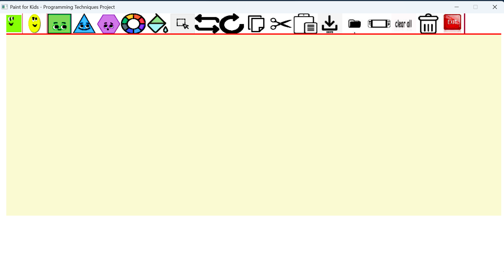
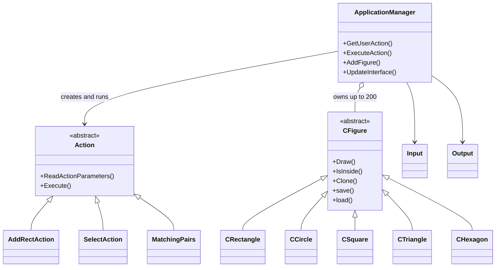

# 🎨 Paint For Kids

A shape-drawing app with two built-in memory games, written in C++ for Windows with the CMUgraphics library. It was built as a **Programming Techniques** course project.

Draw shapes in **Draw mode**, then switch to **Play mode** to play games using the shapes you drew.



## Table of contents

- [Features](#features)
- [Getting started](#getting-started)
- [How to run](#how-to-run)
- [How to use](#how-to-use)
- [Toolbar reference](#toolbar-reference)
- [Save file format](#save-file-format)
- [Architecture](#architecture)
- [Project structure](#project-structure)
- [Known limitations](#known-limitations)
- [Roadmap](#roadmap)
- [Troubleshooting](#troubleshooting)
- [Contributing](#contributing)
- [Credits and licenses](#credits-and-licenses)

## Features

### Draw mode
- Draw **rectangles, circles, squares, triangles and hexagons**
- Change a shape's **outline color** and **fill color** (BLACK, RED, GREEN, BLUE, YELLOW, ORANGE)
- **Select** one or more shapes (the status bar shows details of the selection)
- **Copy, Cut, Paste, Delete** and **Clear All**
- **Swap** the positions of two selected shapes
- **Save** the drawing to a text file and **Load** it back

### Play mode
- **Matching Pairs:** click two shapes. You score a point if they are the same shape type, or both filled with the same color. Otherwise you lose a point.
- **Missing Shapes:** memorize the shapes on screen. One disappears each round and you type its name (`rectangle`, `circle`, `square`, `triangle` or `hexagon`).

## Getting started

### Prerequisites

| Requirement | Details |
|---|---|
| Operating system | **Windows** (CMUgraphics uses the Win32 API, so Linux and macOS are not supported) |
| IDE | **Visual Studio** with the *Desktop development with C++* workload |
| Git (optional) | Only needed to clone; you can also download the ZIP from GitHub |

### Installation

```bash
git clone https://github.com/Mahmoud-Ahmed-Kamal-006/Paint-For-Kids.git
cd Paint-For-Kids
```

No extra libraries are required. CMUgraphics and libjpeg are included in the repository.

## How to run

### Option 1: From Visual Studio (recommended)

1. Open **`PT-Project.sln`** in Visual Studio.
2. **Retarget the solution** if prompted, or if you see the error *"The build tools for Visual Studio 2022 (Platform Toolset = 'v143') cannot be found"*:
   right-click **Solution 'PT-Project'** in Solution Explorer and choose **Retarget Solution**, then click **OK**.
   (Alternatively, install **MSVC v143** build tools via Visual Studio Installer > Modify > Individual components.)
3. Open **Project > Properties > Advanced** and set **Character Set** to *Use Multi-Byte Character Set*. Click **Apply**.
4. In the top toolbar, choose the **Debug** configuration and the **x86 (Win32)** platform.
5. Press **F5** (or **Debug > Start Debugging**) to build and run.

Visual Studio runs the program from the project folder, so the toolbar icons are found automatically.

### Option 2: Run the built `.exe`

After a successful build, the executable is in the `Debug\` folder. It must be launched **from the project folder**, because the icons are loaded using the relative path `images\MenuItems\`:

```bat
cd Paint-For-Kids
Debug\PT-Project.exe
```

Double-clicking the `.exe` inside `Debug\` will fail, because the working directory is then `Debug\` and the `images` folder cannot be found.

## How to use

1. The app starts in **Draw mode**. Click a shape button on the toolbar, then click in the drawing area to place it:
   - **Rectangle / Triangle:** click each corner in turn (2 and 3 clicks)
   - **Circle:** click the center, then a point on the edge
   - **Square / Hexagon:** click the center
2. **Change colors:** select a shape, click the color button, type a color name in the status bar and press **Enter** (**Esc** cancels).
3. **Save:** click **Save**, type a file name and press **Enter**. **Load** reads the same file back and replaces the current drawing.
4. **Play:** click the **Play** button, then choose a game. During a game, click in the playing area to continue, click the game icon to restart, or click the **Draw** icon to leave.

## Toolbar reference

**Draw mode (left to right)**

| Button | Action |
|---|---|
| Rectangle, Circle, Square, Triangle, Hexagon | Draw that shape |
| Color wheel | Change the outline color of selected shapes |
| Paint bucket | Change the fill color of selected shapes |
| Select | Select or unselect a shape (click empty space to unselect all) |
| Swap | Swap the positions of exactly two selected shapes |
| Rotate | Not implemented yet |
| Copy / Cut / Paste | Clipboard for one shape at a time |
| Save / Load | Write or read a drawing file |
| Play | Switch to Play mode |
| Clear All | Remove every shape |
| Delete | Remove selected shapes |
| Exit | Close the application |

**Play mode:** Missing Shape, Matching Shape, and Draw (return to Draw mode).

## Save file format

Each shape is one line of plain text:

```
RECTANGLE <id> <x1> <y1> <x2> <y2> <DRAW_COLOR> <FILL_COLOR | NO_FILL>
CIRCLE    <id> <centerX> <centerY> <edgeX> <edgeY> <DRAW_COLOR> <FILL_COLOR | NO_FILL>
SQUARE    <id> <centerX> <centerY> <DRAW_COLOR> <FILL_COLOR | NO_FILL>
HEXAGON   <id> <centerX> <centerY> <DRAW_COLOR> <FILL_COLOR | NO_FILL>
TRIANGLE  <id> <x1> <y1> <x2> <y2> <x3> <y3> <DRAW_COLOR> <FILL_COLOR | NO_FILL>
```

## Architecture

The design follows the **command pattern**: every toolbar click becomes an `Action` object that `ApplicationManager` creates, executes and deletes. Shapes share the `CFigure` base class and implement drawing, hit-testing, cloning and save/load.



**Main loop** (`main.cpp`): read the user's click, map it to an `ActionType`, execute the matching action, redraw the interface, repeat until Exit.

## Project structure

```
PT-Project.sln          Visual Studio solution
main.cpp                Entry point and main loop
ApplicationManager.*    Owns all figures; creates and runs actions
DEFS.h                  Shared types (ActionType, Point, GfxInfo)
Actions/                One class per user action (add shape, select, copy, save, games...)
Figures/                CFigure base class and the five shape classes
GUI/                    Input and Output classes (toolbar, status bar, drawing)
CMUgraphicsLib/         Third-party graphics library (includes libjpeg)
images/MenuItems/       Toolbar icons (JPEG)
docs/                   README screenshot
```

## Known limitations

- Windows and Visual Studio only
- Up to 200 shapes at a time
- Squares and hexagons have a fixed size
- The Rotate button is not implemented
- No undo or redo
- Clicks outside the drawing area are not rejected while placing shapes

## Roadmap

- [ ] Implement Rotate
- [ ] Undo / redo
- [ ] Validate that clicks land inside the drawing area
- [ ] Resizable squares and hexagons
- [ ] More colors in the color picker
- [ ] Clear error messages instead of silent failures on Save / Load

## Troubleshooting

| Problem | Fix |
|---|---|
| `MSB8020`: v143 build tools cannot be found | Retarget the solution, or install the MSVC v143 build tools (see [How to run](#how-to-run)) |
| Linker error mentioning `timeGetTime` | Add `winmm.lib` under Project > Properties > Linker > Input > Additional Dependencies |
| Program closes immediately, no window appears | Make sure every icon exists in `images\MenuItems\` and run from the project folder |
| Toolbar is blank or the app crashes at startup after double-clicking the `.exe` | Run from the project folder (Option 2 above), not from inside `Debug\` |
| Strange characters or build errors involving strings | Set Character Set to *Use Multi-Byte Character Set* |
| Build fails with platform errors | Use the **Debug** configuration and the **x86 (Win32)** platform |

## Contributing

Suggestions and fixes are welcome.

1. Fork the repository
2. Create a branch: `git checkout -b feature/my-change`
3. Commit your changes: `git commit -m "Describe your change"`
4. Push and open a pull request

Please do not commit build output (`Debug/`, `.vs/`, `*.obj`, `*.suo`, `*.user`).

## Credits and licenses

This project was created for educational purposes. Third-party components keep their own licenses:

- **CMUgraphics Library 1.2**, copyright 1998-1999 Geoff Washburn (with code derived from work by Patrick Doane, Mark Stehlik and Jim Roberts). See `CMUgraphicsLib/version.h` for its license terms.
- **libjpeg 6a** from the [Independent JPEG Group](https://www.ijg.org/), copyright 1991-1996 Thomas G. Lane, used to load the toolbar icons.

**Author:** Mahmoud ([@Mahmoud-Ahmed-Kamal-006](https://github.com/Mahmoud-Ahmed-Kamal-006))
